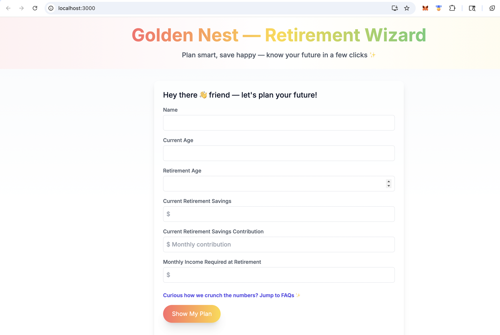

# Golden Nest — Retirement Wizard


Welcome to Golden Nest — a friendly retirement planning app that helps you estimate how much you'll need to save to enjoy a comfortable retirement. Enter a few personal details, and in seconds you'll see a clear plan with a recommended retirement corpus and monthly contribution.

Why this project exists
- Make long-term planning approachable and fun.
- Provide a quick, opinionated estimate to kickstart retirement conversations.

## Tech stack
- React 18
- TypeScript
- Redux Toolkit
- Tailwind CSS
- ApexCharts (for donut chart visualization)

## Screenshots

Calculator (input view)


Results (example output)


## Quick start — clone, install, run

1. Clone the repo

```bash
git clone https://github.com/your-username/golden-nest.git
cd golden-nest
```

2. Install dependencies

```bash
npm install
# or
pnpm install
```

3. Run the app locally

```bash
npm start
# or
pnpm start
```

The app runs at http://localhost:3000 by default.

## Project structure (high level)

- public/ — static assets and screenshots
- src/ — source code
	- features/calculator — main calculator UI and logic
	- components — Banner, FAQs, and UI pieces
	- app — redux store and hooks

## Notes on UX and styling
- The project uses Tailwind CSS for utility-first styling and a small set of custom CSS in `src/App.css` for global fonts and theme tokens.
- Charts are produced with ApexCharts; the donut chart compares required retirement savings vs monthly contribution.

## Contributing
- Found a bug or want to add a feature? Open an issue or send a pull request.
  
## License & Credits
- MIT License — Copyright (c) 2023 Tvisha Mishra

